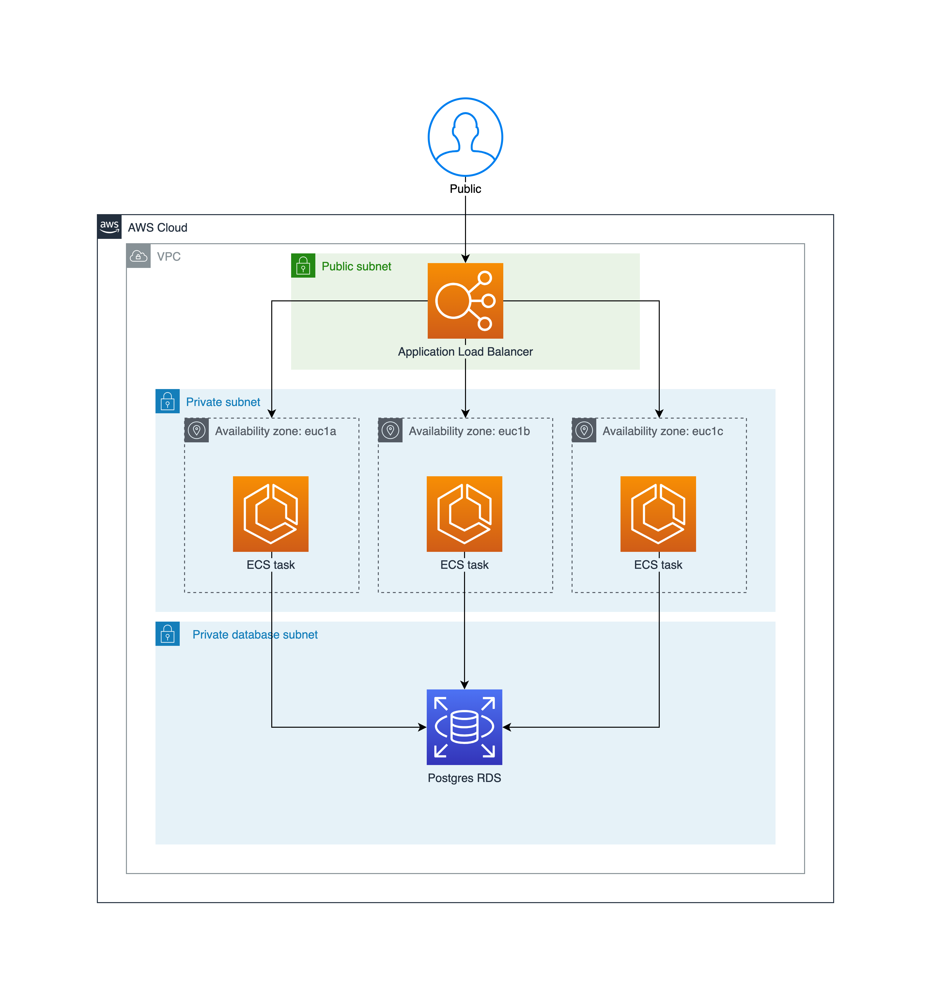

# devops-app

## Implementation



The implementation is a simple AWS-based architecture; Load Balancer (ALB) -> Compute (ECS Fargate) -> Database (RDS). It's single region (eu-central-1) and is capable of using multiple availability zones.

Assuming the service is running (currently scheduled to be online 0800-1800UTC Mon-Fri) it will be accessible via http://devops-app-alb-1892234340.eu-central-1.elb.amazonaws.com/health. If it's not available, an example request/response looks like this:

```
➜  ~ curl -v http://devops-app-alb-1892234340.eu-central-1.elb.amazonaws.com/health
*   Trying 54.93.63.174:80...
* Connected to devops-app-alb-1892234340.eu-central-1.elb.amazonaws.com (54.93.63.174) port 80 (#0)
> GET /health HTTP/1.1
> Host: devops-app-alb-1892234340.eu-central-1.elb.amazonaws.com
> User-Agent: curl/7.87.0
> Accept: */*
>
* Mark bundle as not supporting multiuse
< HTTP/1.1 200 OK
< Date: Fri, 09 Jun 2023 11:30:30 GMT
< Content-Type: text/plain; charset=utf-8
< Content-Length: 3
< Connection: keep-alive
<
UP
* Connection #0 to host devops-app-alb-1892234340.eu-central-1.elb.amazonaws.com left intact
➜  ~
```

Not included in the diagram is an ECR repo for container image storage, security groups, and autoscaling policies.

Only the load balancer is publicly accessible, the ECS cluster and RDS instance are in private subnets. There are three private and three public subnets - one per AZ. The single RDS instance is in all three subnets, whilst the ECS service will balance tasks between the AZs as it scales up and down.

The VPC is a separate terraform state from the backend application. It's likely multiple services would be deployed into a single VPC, in which case the VPC resources would be maintained in an isolated, centralised state (maintained by a devops or platform team) with dependent services importing required data (eg subnets) from this remote state. The same approach should be taken on other key resources, such as the RDS database. Multiple state files in a project allow for separation of concerns which would:

- Improve plan/apply speed compared to larger, monolithic states
- Make it easier for multiple engineers to work on different parts of an application without tripping over one another (state locks, state x can deploy without having to resolve introduced issues in state y)
- Limit the blast radius of bad changes (oops, someone just ran terraform destroy on prod and the db didn't have deletion protection).

## Scaling Strategy
ECS provides horizontal scaling functionality through autoscaling. In this project there are two types of autoscaling policies:

- CPU target tracking. AWS provides CPU Utilisation CloudWatch metrics for the ECS service, which is an average across all tasks. The policy has a defined target value (in this case 60%) and the cluster will attempt to maintain that as a minimum by scaling in and out tasks as required, within the predefined min and max task values.
- Scheduled. The cluster will automatically scale-in to zero tasks at 6pm UTC each weekday, and scale out again at 8am UTC each weekday. This is not something that would be used in a prod environment, but is a useful strategy for reducing cost in non-prod environments outside of working hours.

It can be difficult to get scaling right, especially if you are dealing with unpredictable, peaky traffic. Scaling down is important to reduce costs, but go too far and you risk being under-provisioned when dealing with a thundering herd of inbound traffic and the service is unable to scale up quickly enough to handle the requests.

Multi-region deployments with latency based DNS routing provided by Route53 is an important scaling and resilience strategy, particularly for global, user-facing services. This reduces the blast radius of a potential incident, as the affected region only has to handle a percentage of overall traffic, rather than 100%. Running in multiple regions also provides a failover mechanism should an incident impact a single region - that region can be removed from load and traffic routed elsewhere. Assuming the regions are geographically diverse, a failover region could be experiencing a quiet period (eg overnight, during working hours) reducing the likelihood of that region becoming overloaded, albeit at the cost of higher latency for the end user.

Databases should be deployed as scalable clusters - a primary writer instance with multiple read replicas. New read replicas can take a long time to initialise, so serverless options like Aurora Serverless or DynamoDB could be an option for faster scaling, albeit a potentially expensive one.

Various levels of caching can be used to both serve users faster and reduce traffic or resource utilisation on underlying services, avoiding the need to scale as frequently. Depending on the usecase, this could be a CDN, an in-memory K/V database like redis, or simply using an OS level file cache.

## CI implementation
This project uses GitHub Actions for CI. 

Two workflows have been created; one for publishing container images to ECR, a second for running terraform.

The terraform workflow uses a GitHub environment (`dev`) on the 'apply' job, which has been configured to require approval. This provides an engineer the opportunity to review the `terraform plan` output before proceeding to `terraform apply`. As this approval gate requires the use of multiple jobs, at the end of the 'plan' job, the `terraform plan` is saved to a file. This file is uploaded to GHA and then downloaded by the subsequent 'apply' job, ensuring the exact actions in the `terraform plan` are ran during the `terraform apply`. Aside from being technically necessary, this is helpful for situations where there may be a delay to engineer review and approval.

These workflows are independent of one another and mainly triggered manually through the GHA UI. In reality these should be written as re-usable actions which can be used together in workflows to build, test, plan and deploy an application and infrastructure.

Different workflow triggers based on GitHub events should also be used to automate deployments. For example (assuming dev, stage, prod environments):

| Event | Action |
| --- | --- |
| Push to feature branch | test, terraform plan |
| Workflow dispatch (manual trigger) | deploy to dev |
| Push to main branch | deploy to stage |
| Tag push | deploy to prod |

For this project a GitHub OIDC identity provider has been configured in AWS, allowing the repo to interact with the AWS account with an IAM role without needing to manage access tokens.

### Zero Downtime Deployments
ECS rolling deployments will start new tasks whilst keeping the old tasks running simultaneously. Once the new tasks are running and are passing healthchecks, the old tasks will be stopped. When used in conjunction with connection draining on the load balancer, the old tasks will be allowed to complete in-flight requests before being de-registered. Any new requests during this period will be routed to the new tasks.

`minimumHealthyPercent` and `maximumPercent` can be used to configure deployment batch sizes by defining upper and lower limits on the number of running tasks.

## Monitoring/Alerting Approach
If I were to implement some monitoring into this project, it would have been through CloudWatch alarms and dashboards. The alarms would have been based on the standard metrics included with ECS, RDS and ALB - CPU/Memory utilisation, 4xx/5xx response rates etc. The alarms would trigger when the metric exceeds a threshold for a defined length of time, publish a notification to an SNS topic which would send an email.

## Security
The primary security concern addressed in this project is networking - only the ALB is publicly accessible and security groups have been used to restrict inbound traffic to only the required ports. 

IAM hasn't been a focus, there hasn't been much need to define permissions, and AWS managed IAM policies have been suitable where needed. Using the principle of least privilege, AWS managed policies should be replaced with self-managed policies that have scoped down to only provide the permissions that are necessary.

The ALB only accepts inbound traffic on port 80, but this should be restricted to HTTPS following modern, accepted conventions. TLS certificates are free and easy to obtain and attach to resources through ACM. This hasn't been addressed in this project because certs require a custom domain name and there's a limit to how much I'm willing to do for a coding challenge.

This project takes a security through obscurity approach to secrets - the database password is not stored in the codebase, it's a randomly generated password created on database creation and the ECS container definition references the module output rather than the string. However this password can be found in plain text by anyone with the ability to run terraform, read the terraform state, or log into AWS and read the ECS container definition. Whilst there's not a lot that that can be done with the database password, given the database is in a private subnet with no internet access, it's good practice to treat all secrets with great care. They should be stored in a secrets engine like Vault or AWS Secrets Manager and ideally applications should use a client to retrieve them at runtime. Runtime retrieval also allows for fast, easy secret rotation - applications that inject secrets at build time would require a redeployment.
